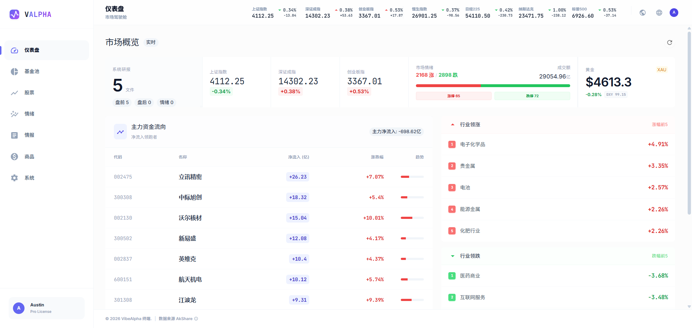
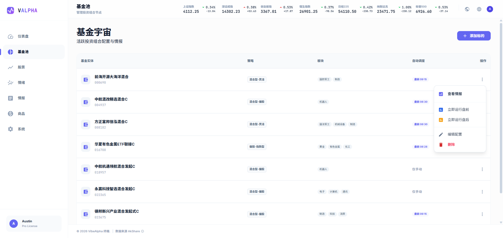
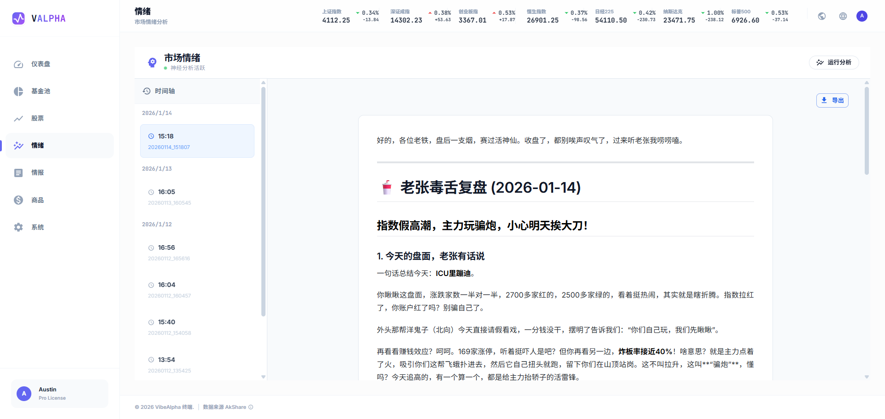
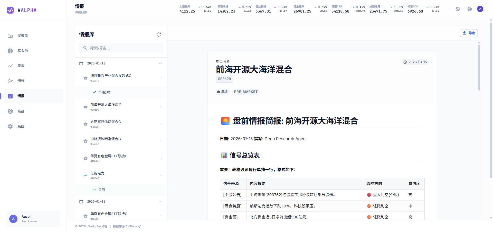
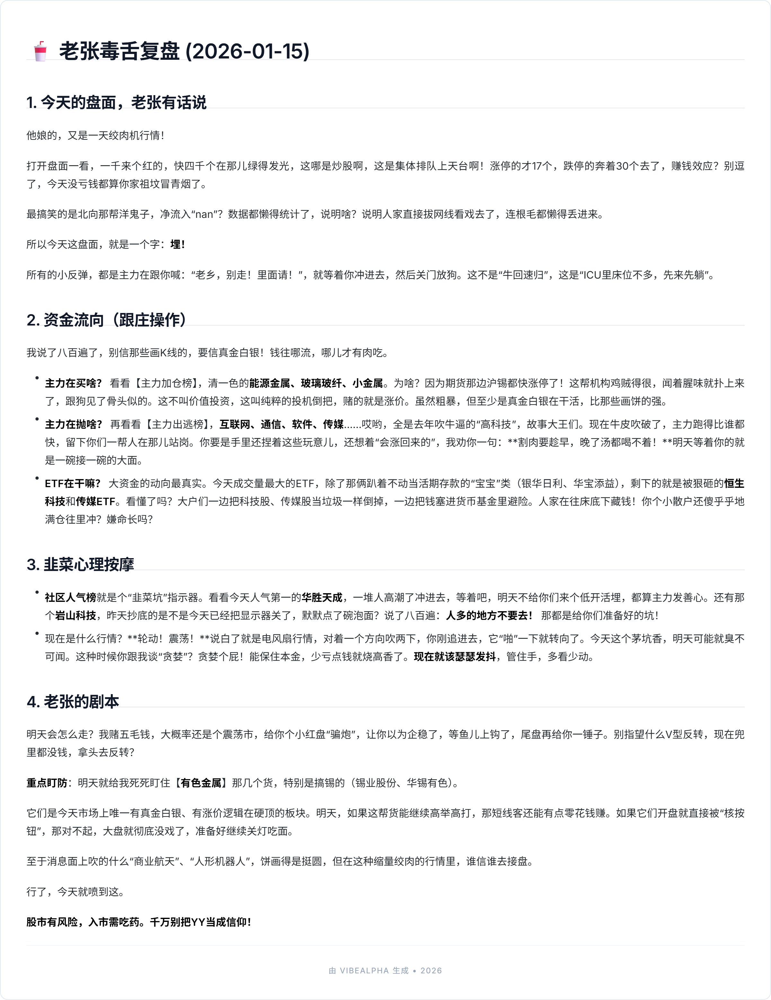

# VibeAlpha Terminal

<p align="center">
  
  
  
  
  
</p>

<p align="center">
  <b>智能金融情报终端 | AI-Powered Financial Intelligence Platform</b>
</p>

---

## 简介

**VibeAlpha Terminal** 是一个专注于中国 A 股市场的智能金融分析平台，集成了基金分析、股票监控、商品追踪和市场情绪分析等功能。通过 AI 大语言模型自动生成专业的盘前/盘后分析报告，帮助投资者做出更明智的决策。

### 核心特性

- **基金分析** - 管理基金池，自动生成盘前策略和盘后复盘报告
- **股票监控** - 自选股追踪，支持基本面+技术面综合分析
- **商品情报** - 黄金、白银等贵金属实时分析
- **市场情绪** - 基于新闻和社交媒体的情绪分析
- **定时任务** - 支持自动化报告生成调度
- **多语言支持** - 中文/英文界面切换
- **多 LLM 支持** - 支持 Gemini、OpenAI 等多种 AI 模型

---

## 技术栈

### 后端
| 技术 | 说明 |
|------|------|
| **Python 3.10+** | 主要开发语言 |
| **FastAPI** | 高性能 Web 框架 |
| **AkShare** | A 股市场数据源 |
| **APScheduler** | 定时任务调度 |
| **SQLite** | 轻量级数据库 |
| **Gemini / OpenAI** | AI 报告生成 |
| **Tavily** | 实时网络搜索 |

### 前端
| 技术 | 说明 |
|------|------|
| **React 19** | UI 框架 |
| **TypeScript** | 类型安全 |
| **Vite 7** | 构建工具 |
| **Material-UI 7** | 组件库 |
| **Tailwind CSS** | 样式框架 |
| **i18next** | 国际化 |

---

## 项目结构

```
eastmoney/
├── api_server.py          # FastAPI 后端入口
├── main.py                # 命令行入口
├── requirements.txt       # Python 依赖
├── funds.db              # SQLite 数据库
│
├── src/                  # 后端源码
│   ├── analysis/         # 分析模块
│   │   └── strategies/   # 策略模式实现
│   ├── data_sources/     # 数据源接口 (AkShare)
│   ├── llm/              # LLM 集成 (Gemini/OpenAI)
│   ├── scheduler/        # 定时任务
│   ├── storage/          # 数据库操作
│   ├── auth.py           # JWT 认证
│   └── report_gen.py     # 报告生成
│
├── web/                  # React 前端
│   ├── src/
│   │   ├── pages/        # 页面组件
│   │   ├── components/   # 通用组件
│   │   ├── locales/      # 国际化文件
│   │   └── api.ts        # API 客户端
│   └── package.json
│
├── reports/              # 生成的分析报告
├── config/               # 配置文件
└── docker/               # Docker 部署文件
```

---

## 快速开始

### 环境要求

- Python 3.10+
- Node.js 18+
- npm 或 yarn

### 1. 克隆仓库

```bash
git clone https://github.com/your-username/vibe-alpha.git
cd vibe-alpha
```

### 2. 后端安装

```bash
# 创建虚拟环境
python -m venv venv

# 激活虚拟环境
# Windows
venv\Scripts\activate
# Linux/Mac
source venv/bin/activate

# 安装依赖
pip install -r requirements.txt
```

### 3. 前端安装

```bash
cd web
npm install
```

### 4. 配置环境变量

在项目根目录创建 `.env` 文件：

```env
# LLM 配置 (至少配置一个)
GEMINI_API_KEY=your_gemini_api_key
OPENAI_API_KEY=your_openai_api_key

# 网络搜索 (情绪分析需要)
TAVILY_API_KEY=your_tavily_api_key

```

### 5. 启动服务

```bash
# 启动后端 (端口 8000)
python api_server.py

# 新终端，启动前端 (端口 5173)
cd web
npm run dev
```

访问 http://localhost:5173 即可使用。

---

## 功能截图

> 截图待添加

| 仪表盘 | 基金分析 |
|--------|----------|
|  |  |

| 股票监控 | 情报报告 |
|----------|----------|
|  |  | 


| 情绪分析报告 |
|----------|


---

## API 文档

启动后端后，访问以下地址查看 API 文档：

- **Swagger UI**: http://localhost:8000/docs
- **ReDoc**: http://localhost:8000/redoc

### 主要 API 端点

| 端点 | 方法 | 说明 |
|------|------|------|
| `/api/auth/token` | POST | 用户登录 |
| `/api/funds` | GET/PUT/DELETE | 基金管理 |
| `/api/stocks` | GET/PUT/DELETE | 股票管理 |
| `/api/generate/{mode}` | POST | 生成报告 |
| `/api/reports` | GET | 获取报告列表 |
| `/api/sentiment/analyze` | POST | 情绪分析 |
| `/api/dashboard/overview` | GET | 仪表盘数据 |

---

## 配置说明

### LLM 提供商

在系统设置页面可以切换 AI 模型：

- **Gemini** (推荐) - Google 的 Gemini Pro 模型
- **OpenAI** - GPT-5.0 系列模型

### 定时任务

支持为每个基金/股票配置独立的分析时间：

- **盘前分析**: 默认 08:30 (开盘前)
- **盘后分析**: 默认 15:30 (收盘后)

---

## 开发指南

### 代码规范

```bash
# 前端 lint
cd web && npm run lint

# 前端构建
cd web && npm run build
```

### 添加新的分析策略

1. 在 `src/analysis/strategies/` 创建新策略类
2. 继承 `AnalysisStrategy` 基类
3. 实现 `collect_data()` 和 `generate_report()` 方法
4. 在 `factory.py` 中注册新策略

---

## 部署

### 后端 Docker 部署

```bash
# 构建镜像 根目录执行
./run_docker.sh
```

### 前端Nginx 部署

建议使用 Nginx 反向代理部署前端：

```nginx
server {
    listen 80;
    listen [::]:80;
    server_name xxxxx.cn;  #替换成你的域名

    # React应用的根目录
    root /upload/valpha/frontend/dist;   #配置成你打包上传的npm 包路径
    index index.html;

    # 访问日志和错误日志
    access_log /var/log/nginx/valpha_access.log;
    error_log /var/log/nginx/valpha_error.log;

    # Gzip压缩配置（提高加载速度）
    gzip on;
    gzip_vary on;
    gzip_min_length 1024;
    gzip_types text/plain text/css text/xml text/javascript application/x-javascript application/xml+rss application/json application/javascript;

    # 处理React Router（重要！）
    location / {
        try_files $uri $uri/ /index.html;
    }

    location /api/ {
           proxy_pass http://127.0.0.1:9000/api/;
            proxy_set_header Host $host;
            proxy_set_header X-Real-IP $remote_addr;
           }
    # 静态资源缓存
    location ~* \.(jpg|jpeg|png|gif|ico|css|js|svg|woff|woff2|ttf|eot)$ {
        expires 1y;
        add_header Cache-Control "public, immutable";
    }


    # 禁止访问隐藏文件
    location ~ /\. {
        deny all;
        access_log off;
        log_not_found off;
    }
}
```

---

## 贡献指南

欢迎提交 Issue 和 Pull Request！

1. Fork 本仓库
2. 创建特性分支 (`git checkout -b feature/AmazingFeature`)
3. 提交更改 (`git commit -m 'Add some AmazingFeature'`)
4. 推送到分支 (`git push origin feature/AmazingFeature`)
5. 提交 Pull Request

---

## 许可证

本项目采用 MIT 许可证 - 详见 [LICENSE](LICENSE) 文件

---

## 致谢

- [AkShare](https://github.com/akfamily/akshare) - 优秀的 A 股数据接口
- [Material-UI](https://mui.com/) - React 组件库
- [FastAPI](https://fastapi.tiangolo.com/) - 现代 Python Web 框架

---

<p align="center">
  Made with ❤️ for Chinese Market Investors
</p>
